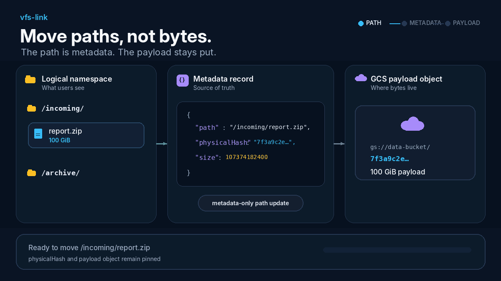

<h1 align="center">vfs-link</h1>

<p align="center">
  <strong>Move paths, not bytes.</strong>
</p>

<p align="center">
  A metadata-first virtual filesystem for local storage and Google Cloud Storage.<br>
  The path is metadata. The payload stays put.
</p>

<p align="center">
  <a href="LICENSE"></a>
  
  
  
</p>

<p align="center">
  
</p>

> [!IMPORTANT]
> **Rename a 100 GiB file: 0 B of payload copied.**  
> vfs-link changes the logical namespace while keeping the underlying object at the same stable physical key.

## The core idea

Object storage often encourages a path-coupled layout:

```text
user-visible path                         physical object key
─────────────────                         ───────────────────
/incoming/report.zip  ─────────────────>  gs://bucket/incoming/report.zip

MOVE /incoming/report.zip
  TO /archive/report.zip

/archive/report.zip   ─────────────────>  gs://bucket/archive/report.zip
                                              ▲
                                              └─ the storage key must change
```

Depending on the bucket mode, API, and tool being used, changing that key may
become a copy-and-delete, rewrite, or storage-level rename. In every case, the
logical filesystem namespace is coupled to the physical object layout.

vfs-link inserts a metadata layer between the path users see and the object that
stores the bytes:

```text
logical namespace              metadata mapping                 physical storage
─────────────────              ────────────────                 ────────────────
/incoming/report.zip  ───────>  physicalHash: incoming/report.zip  ───>  gs://data/incoming/report.zip
                                                                    100 GiB

MOVE /incoming/report.zip
  TO /archive/report.zip

/archive/report.zip   ───────>  physicalHash: incoming/report.zip  ───>  gs://data/incoming/report.zip
                                                                    same object
                                                                    same bytes
```

Only the logical mapping changes. The payload object is neither copied nor
renamed by vfs-link.

### The JSON tree is the filesystem

With `DB_DRIVER=json`, JSON metadata is not a cache and not a secondary index.
It is the source of truth for the logical filesystem namespace.

Conceptually, a file record connects a human-readable path to a stable physical
object key. New uploads start with a portable, sanitized form of the original
logical path; later logical renames do not change that key:

```json
{
  "path": "/archive/report.zip",
  "physicalHash": "incoming/report.zip",
  "size": 107374182400
}
```

The distributed metadata tree stores small file and directory sidecars,
directory indexes, entity records, operation manifests, and aggregate
statistics beneath a reserved versioned prefix. File payloads live separately
in the active local or GCS storage backend.

For GCS-backed metadata, writes use generation-match preconditions so concurrent
instances cannot silently overwrite one another.

## What actually changes during a move?

| Operation | Logical metadata | Payload object |
| --- | --- | --- |
| Rename a file | Path mapping is updated | Unchanged — **0 B copied** |
| Move a file | Parent/path mapping is updated | Unchanged — **0 B copied** |
| Move a directory | Metadata records and indexes are updated | Every payload remains unchanged |
| Move to trash | Active mappings are hidden | Retained in place |
| Restore from trash | Mappings are restored | Reused in place |
| Permanently delete | Metadata is removed | Physical object is deleted |

A 1 KiB file and a 100 GiB file therefore have the same **payload-copy cost**
for a logical rename: zero.

> [!NOTE]
> Metadata-only does not mean zero work. A large directory operation may touch
> many metadata records and indexes. With the JSON backend it runs as a
> recoverable operation with a persisted manifest, lease, checkpoints, retries,
> and an operation ID. The important property is that work scales with namespace
> metadata—not with the total number of payload bytes beneath the directory.

## Why this separation matters

- **Large-file moves stay lightweight.** A logical path change does not scale
  with file size.
- **Payload keys remain stable.** User organization can evolve without
  reorganizing the primary object bucket.
- **Metadata and payloads can use different storage policies.** Keep frequently
  updated JSON metadata in a dedicated Standard-class bucket and large,
  infrequently accessed file bytes in a separate primary bucket.
- **Trash and restore do not duplicate data.** Bytes are retained until a
  permanent deletion is requested.
- **The same namespace works across access methods.** The browser, HTTP API,
  WebDAV, and transitional FTP resolve the same logical paths.
- **Serverless instances can coordinate safely.** GCS preconditions and
  persisted operation state protect distributed metadata mutations.

## Architecture

```text
                               logical filesystem operations

 WebDAV client ── HTTPS ──┐
 Browser ─────── HTTP(S) ─┼────> file-server ───────────────┐
 FTP client ────── FTP ───┘          │                      │
                                     │                      │
                                     ▼                      ▼
                          PostgreSQL or JSON         local volume or GCS
                          metadata namespace         payload objects
                          ──────────────────         ───────────────
                          paths                      stable physical keys
                          directories                immutable-by-move bytes
                          indexes                    range-readable objects
                          trash records
                          operation state
```

For browser uploads with GCS primary storage, file bytes can travel directly to
a resumable GCS upload session. The server verifies the completed object and
then atomically publishes its logical mapping:

```text
Browser ── create session ──> file-server
   │                              │
   ├──── resumable PUT ──────────> GCS final sanitized key
   │                              │
   └──── complete session ───────> verify object ──> publish logical mapping
```

## Features

- PostgreSQL-backed or distributed JSON-backed logical filesystem
- Local filesystem or Google Cloud Storage payload backend
- Browser UI and HTTP API
- Direct-to-GCS resumable browser uploads
- WebDAV operations, range downloads, streaming uploads, and PostgreSQL-backed
  `LOCK` / `UNLOCK`
- Transitional FTP support for legacy client migration
- Batch move, trash, restore, permanent-delete, and operation polling APIs
- Optional GCS and Telegram sharing workflow
- Optional Pub/Sub dispatch for serverless share jobs
- Mapping rebuild, metadata migration, and physical-object health checks
- Optional drift viewer, cost plan, and explicit GCS physical reconciliation
- Docker Compose for self-hosting and an HTTP-only Cloud Run deployment model

## Quick start

### Prerequisites

- Docker Engine
- Docker Compose v2

### Start the default stack

```bash
git clone https://github.com/twkevinzhang/vfs-link.git
cd vfs-link
cp .env.example .env

# Replace every CHANGE_ME password before starting.
docker compose config
docker compose up -d --build

curl -fsS http://localhost:8080/api/status
```

The default Compose profile uses:

| Concern | Default |
| --- | --- |
| Metadata | PostgreSQL |
| Payload storage | Persistent local Docker volume |
| Browser and HTTP API | Port `8080` |
| WebDAV | Disabled |
| FTP | Enabled on port `21` |
| FTP passive ports | `30000-30100` |

Open the browser UI at `http://localhost:8080/` after the service is healthy.

> [!WARNING]
> Do not expose the default stack directly to the public internet. Replace every
> example password, enable HTTP Basic Auth for the browser/API, terminate TLS at
> a trusted ingress or reverse proxy, and expose WebDAV only over HTTPS. Keep
> plaintext FTP on a private network and disable it after migration.

## Deployment profiles

| Profile | Metadata | Payloads | Typical access |
| --- | --- | --- | --- |
| Private self-hosted server | PostgreSQL | Local persistent volume | Browser/API, optional WebDAV and FTP |
| ipproxy host-managed services | Existing PostgreSQL (`vfs_link_ipproxy`) | Host bind mount | Browser/API, optional WebDAV and FTP |
| Database-free local instance | Local JSON tree | Local persistent directory | Browser/API or development |
| Serverless browser/API | JSON tree in dedicated GCS bucket | Primary GCS bucket | HTTP on Cloud Run or a similar platform |
| Serverless WebDAV | External PostgreSQL | Primary GCS bucket | WebDAV over managed HTTPS ingress |

See [ipproxy deployment profile](docs/ipproxy.md) for the immutable-image,
external-network deployment that reuses ipproxy's managed PostgreSQL service.

### GCS-backed JSON metadata

Configure metadata and payload storage independently:

```dotenv
DB_DRIVER=json
METADATA_STORAGE_DRIVER=gcs
METADATA_GCS_BUCKET=your-vfs-link-metadata-bucket
# Select the prefix appropriate for your deployed version and migration state.
METADATA_PREFIX=_vfs-link-v3

STORAGE_DRIVER=gcs
GCS_BUCKET=your-vfs-link-primary-bucket
```

Use a dedicated **Standard-class** metadata bucket in the same region as the
service. The primary bucket holds file bytes and can use a storage policy chosen
for the payload access pattern.

For an HTTP-only serverless deployment, also disable stateful network protocols
and protect the application endpoint:

```dotenv
FTP_ENABLED=false
WEBDAV_ENABLED=false
HTTP_BASIC_AUTH_ENABLED=true
HTTP_BASIC_AUTH_USER=vfs_link
HTTP_BASIC_AUTH_PASS=use-a-managed-secret
```

See [Cloud Run HTTP file-server](docs/cloud-run.md) for Pub/Sub, CORS, service
accounts, instance CPU behavior, sharing, rollout, and rollback details.

## WebDAV

WebDAV is mounted at `/dav/` by default and rejects requests that are not HTTPS.
Enable it only behind a trusted ingress or reverse proxy:

```dotenv
WEBDAV_ENABLED=true
WEBDAV_PATH=/dav/
WEBDAV_USER=vfs_link
WEBDAV_PASS=use-a-unique-app-password
WEBDAV_TRUST_FORWARDED_HEADERS=true
```

The proxy must overwrite `X-Forwarded-Proto`, preserve `Authorization` and DAV
headers, and allow methods such as `PROPFIND`, `MKCOL`, `COPY`, `MOVE`, `LOCK`,
and `UNLOCK`.

A standard WebDAV `PUT` is one streaming request. Cross-request resumable upload
is provided by the browser/custom upload API, not by the WebDAV endpoint.

## Browser upload contract

Local and GCS storage expose the same three-stage flow:

1. `POST /api/uploads` creates an upload session.
2. The client sends the bytes to the returned `uploadUrl`.
3. `POST <completeUrl>` verifies the object and conditionally publishes the
   logical mapping.

With GCS, the browser uploads directly to Cloud Storage instead of routing large
payload bytes through the file-server container. The default maximum declared
file size is 50 GiB and the default session lifetime is 24 hours.

The object key is derived once from the uploaded logical path. Unsupported
Windows/Unix filename characters are replaced with `_`; path separators remain
path separators. A rename still updates metadata only. See
[Storage drift](docs/drift.md) for comparing and explicitly reconciling the two
namespaces.

## Move and trash API

| Endpoint | Purpose |
| --- | --- |
| `POST /api/files/move` | Move selected roots into a destination directory |
| `POST /api/files/trash` | Hide active mappings while retaining payload objects |
| `GET /api/trash` | List top-level trash groups |
| `POST /api/trash/restore` | Restore complete trash groups |
| `POST /api/trash/delete` | Permanently delete selected groups |
| `POST /api/trash/empty` | Permanently delete every trash group |
| `GET /api/operations/{operationId}` | Poll a recoverable JSON-tree operation |

PostgreSQL completes metadata transactions synchronously. JSON-tree directory
operations can return `202 Accepted` and continue from persisted operation
state.

## Maintenance

```bash
# Compare logical mappings with physical objects without changing data.
docker compose exec file-server ./physical-health --fail-on-unhealthy

# Also validate active records and aggregate metadata.
docker compose exec file-server ./physical-health \
  --check-metadata-aggregates --fail-on-unhealthy

# Rebuild mappings from the active object store. Read the warning first.
docker compose exec file-server ./file-server rebuild-mapping --yes

# Inspect distributed metadata migration options.
docker compose exec file-server ./metadata-migrate --help
```

`physical-health` is read-only and should be the first diagnostic tool.
`rebuild-mapping` is destructive to existing mapping assumptions and should be
used only with a verified backup.

## Documentation

- [Self-hosting](docs/self-hosting.md)
- [ipproxy deployment profile](docs/ipproxy.md)
- [Configuration reference](docs/configuration.md)
- [Storage and GCS](docs/storage.md)
- [Distributed JSON metadata migration](docs/metadata-migration.md)
- [Networking and exposure](docs/networking.md)
- [WebDAV and serverless deployment](docs/webdav.md)
- [Browser upload API](docs/uploads.md)
- [Storage drift](docs/drift.md)
- [Move, trash, and operations](docs/operations.md)
- [Cloud Run HTTP file-server](docs/cloud-run.md)
- [Development](docs/development.md)

## Development

Prerequisites: Go 1.23+, Node.js 22+, Corepack/pnpm, and Docker Compose v2.

```bash
# Backend tests
cd apps/file-server
./scripts/go.sh test ./...

# Frontend checks, from the repository root
pnpm --dir apps/web typecheck
pnpm --dir apps/web lint
pnpm --dir apps/web build

# Container build
docker build -f apps/file-server/Dockerfile -t vfs-link/file-server:test .
```

See [Development](docs/development.md) for local PostgreSQL and database-free JSON
startup commands.

## Security

Report vulnerabilities through GitHub's private security advisory workflow. Do
not open public issues containing credentials, production URLs, user data,
private keys, database dumps, or object-storage contents. See
[SECURITY.md](SECURITY.md).

## License

vfs-link is available under the [MIT License](LICENSE).
